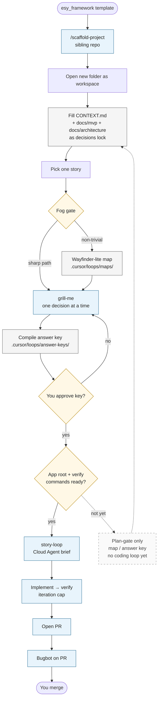

# Framework lifecycle

How work moves from a new project through clarity gates to one story → one PR.

Use this diagram in decks (screenshot Mermaid) or keep it as the editable source of truth.

## Reading the main path

1. Scaffold a sibling project from this template.
2. Lock product/architecture truth before inventing behavior or stack.
3. Clear fog (optional map) and grill open decisions.
4. Approve a pass/fail answer key.
5. When verify exists: story-loop → PR → Bugbot → you merge.

## Dashed branch

If the app root or verify runners are not ready, stop at map/answer key (plan-gate only). Do not run a coding loop that invents “done.”
