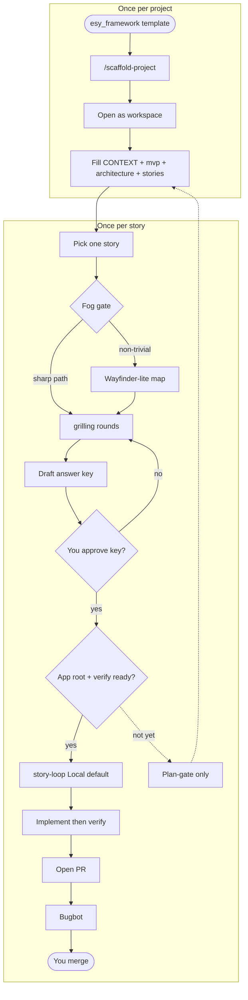

# Framework lifecycle

How work moves from a new project through clarity gates to one story → one PR.

Once-per-project (scaffold → lock CONTEXT/docs) is a different clock from once-per-story (pick → PR → merge). Use this diagram in decks (screenshot Mermaid) or keep it as the editable source of truth.

## Reading the main path

1. **Once per project:** scaffold a sibling from this template, then lock product/architecture in CONTEXT, `docs/mvp/`, and `docs/architecture/`. A product grill persist also writes `docs/stories/STORY-xx.md` (one story → one PR). Do not invent behavior or stack.
2. **Once per story:** pick one `STORY-xx` from `docs/stories/`. Clear fog (optional map) and grill open decisions in grilling rounds (`/grill-me` with no app code; `/grill-with-docs` once a codebase exists). Story-loop consumes stories; it does not create them.
3. When fog and opens are empty, the agent drafts the answer key in the same turn. There is no separate “OK to compile.”
4. You approve the key. Every product check must name a verifier (test, command, or `human-only: …`; cap human-only at 1–2).
5. When verify exists: story-loop (Local default; Cloud on `unattended`) → PR → Bugbot → you merge. Trivial Bugbot nits stay on the same PR; findings that contradict the key stop and wait for you.

## Dashed branch

If the app root or verify runners are not ready, stop at map/answer key (plan-gate only). Fill CONTEXT/docs if they are still empty, then re-enter at pick story. Do not run a coding loop that invents “done.”
