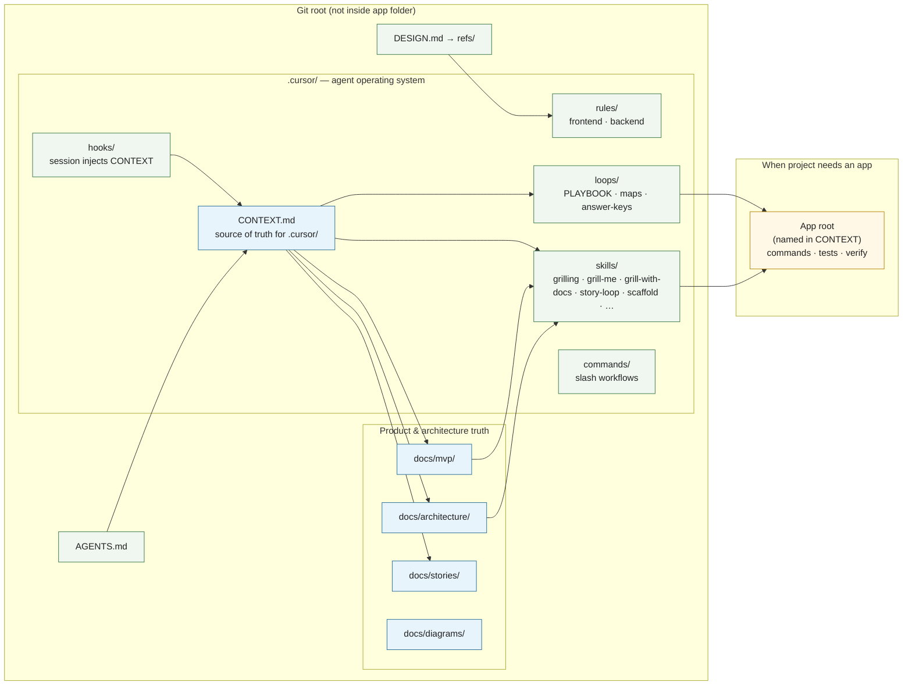

# Where truth lives

How humans and agents share one map of product, architecture, and execution conventions. Agents read left-to-right priority: **CONTEXT → docs → skills/rules → app code**.

## Priority for agents

1. Prefer `docs/mvp/` over inventing product behavior.
2. Prefer `docs/architecture/` over inventing a stack.
3. Read `.cursor/CONTEXT.md` before applying skills, rules, commands, or hooks.
4. Keep docs and `.cursor/` at the git root; run app commands from the app root named in CONTEXT.
5. Do not invent scope when docs are empty — ask or grill first.

## Artifacts called out in the lifecycle

| Artifact | Path |
|----------|------|
| Agent context | `.cursor/CONTEXT.md` |
| Domain glossary | `docs/glossary.md` (lazy; domain-modeling via grill-with-docs) |
| ADRs | `docs/adr/` (lazy; domain-modeling via grill-with-docs) |
| Stories inventory | `docs/stories/STORY-xx.md` (product grill persist) |
| Story maps | `.cursor/loops/maps/` |
| Answer keys | `.cursor/loops/answer-keys/` |
| Playbook | `.cursor/loops/PLAYBOOK.md` |
